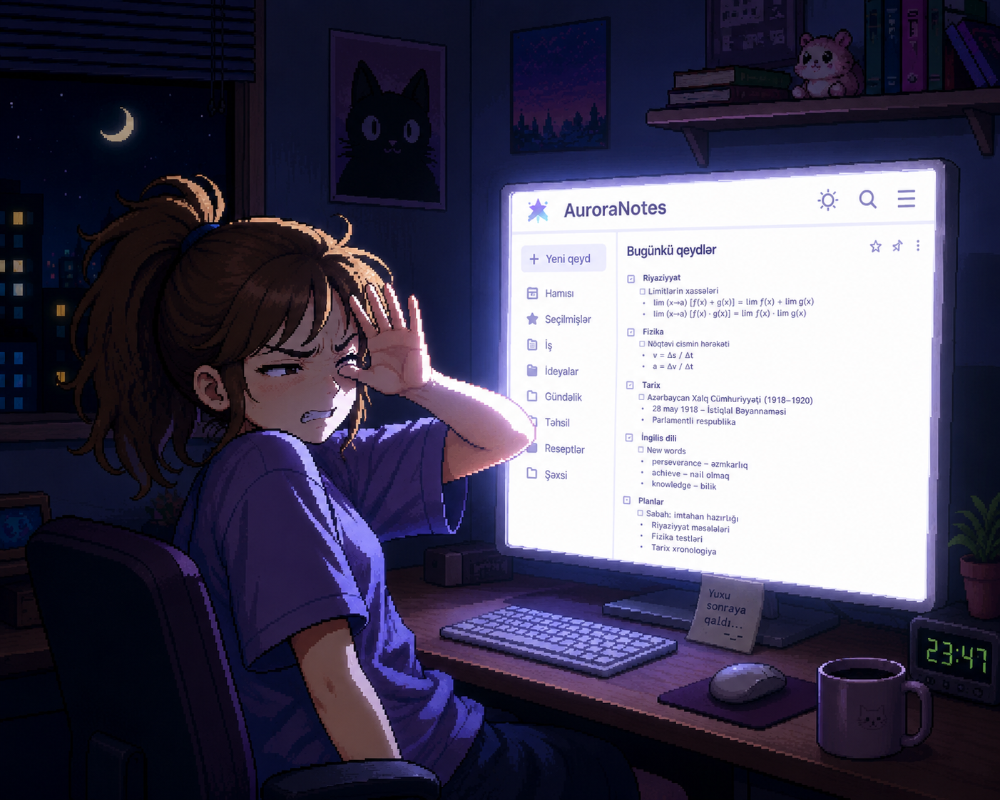

# Lab: Lights Out



## Introduction

The app you inherited this time, **Aurora Notes**, is
clean and it works. There is just one problem: it only knows daylight. Open it at
2am and it burns your eyes. Your team lead wants a **dark mode**, and your designer
has already handed over the palette.

The button is already on the page. It just does nothing. Your job is to give it a
brain.

This lab is about a skill you will use constantly: **sharing a piece of state
across your whole app with React Context**. The theme is the perfect excuse,
because a theme is not "page state." It belongs to everything: the page, the card,
the button, and anything you add later. That is exactly the kind of state that
should live above your components, not inside one of them.

## The situation

Your team lead dropped this in your DMs:

> "Aurora Notes looks great in the light, but our users have been requesting the dark
> mode for years. The designer already gave us the colors, they
> are wired into the stylesheet. 
> Today it is one button on one page, but tomorrow there will be a navbar, a settings screen, ten
> components. I do not want the theme trapped inside the page. Whatever you build,
> the whole app should be able to read it and change it. Good luck!"

That last sentence is the heart of this lab. The theme cannot live inside
`page.js`. It has to live somewhere **above** your app, where every component can
reach it. That is what React Context is for, and building it is your job.

## The palette

Your designer already did the color work and wired it into `app/globals.css` as CSS
variables. There is a light set on `:root` and a dark set on a `.dark` class. You
do not choose colors. You decide *when* the `.dark` set is active.

| Token                  | Light (`:root`) | Dark (`.dark`) |
| ---------------------- | --------------- | -------------- |
| `--background`         | `#ffffff`       | `#0f172a`      |
| `--surface`            | `#f4f4f5`       | `#1e293b`      |
| `--foreground`         | `#18181b`       | `#e2e8f0`      |
| `--muted`              | `#71717a`       | `#94a3b8`      |
| `--accent`             | `#4f46e5`       | `#818cf8`      |
| `--accent-foreground`  | `#ffffff`       | `#0f172a`      |
| `--border`             | `#e4e4e7`       | `#334155`      |

Those tokens are exposed to Tailwind as utilities, so the page already paints
itself with `bg-background`, `bg-surface`, `text-foreground`, `text-muted`,
`bg-accent`, and `border-border`. The magic: the moment the `.dark` class is
present, every one of those variables swaps to its dark value and the whole page
recolors on its own. You never touch the colors. You only turn the `.dark` class
on and off.

## What you will build

- A **theme context** that holds the current theme and a way to change it.
- A **provider** (the "context wrapper") that owns the theme state and shares it.
- The **wiring** that wraps your whole app in that provider.
- The **toggle**: make the existing button flip between light and dark.

## Getting started

```bash
npm install
npm run dev
```

Open <http://localhost:3000>. You will see Aurora Notes in light mode with a card
and a **"Switch to dark mode"** button. Click it. Nothing happens. That is the
correct starting state, the button has no brain yet. Note that the app stays light
even if your computer is in dark mode, that is on purpose, the theme is yours to
control now.

## Heads up: this is not the Next.js in your old notes

This project runs a **newer version of Next.js** with breaking changes, and it uses
**Tailwind v4**. Before you paste a snippet from somewhere, skim the relevant guide
in `node_modules/next/dist/docs/`, especially the **Server and Client Components**
guide.

Things that will bite you if you do not:

- Components are **Server Components by default**. Hooks like `useState` and
  `useContext`, and event handlers like `onClick`, **only work in Client
  Components**. You make a file a Client Component by putting `'use client'` at the
  very top.
- It is **JavaScript** (`.js`), not TypeScript.
- Tailwind v4: classes work the same, just do not go hunting for a
  `tailwind.config.js`, there is not one.

## Your job

Build it in this order. You learned the context code in the lessons and your job is to apply it here. These are the goals:

### 1. Create the theme context and its provider

Make a context for the theme and a provider component that owns the state (light or
dark) and exposes a way to flip it. This is the "context wrapper" the situation is
talking about. Put it somewhere sensible, for example `app/context/ThemeContext.js`
(the location is your call).

### 2. Wrap your whole app in the provider

A provider only shares state with what it wraps. Find the one place where wrapping
once covers the entire app, and wrap `children` there. Look at `app/layout.js`.

### 3. Wire the button to flip the theme

Open `app/page.js`. The button is already there. Make it read the theme from your
context and flip it on click. Remember the rule from the heads up: a component that
uses a hook or an `onClick` has to be a Client Component.

### 4. Make the palette actually apply

Flipping a value in state does nothing visible on its own. The colors only change
when the **`.dark` class** is present. So your provider has to put that class on the
page when the theme is dark and take it off when it is light. The palette is already
waiting in `app/globals.css`, you just decide where the class lands.

## 💡 Think about it

No code here, just the decisions that make or break this lab.

- **Where does the theme live?** If you keep it in `page.js`, the button works but
  your future navbar can never reach it. The whole point of the situation is to lift
  it *above* the app. That is the provider's job.
- **What has to become a Client Component, and what can stay on the server?** Reading
  context and handling clicks need the browser. Be deliberate about which files get
  `'use client'` and which do not.
- **Where do you put the `.dark` class?** On the `<html>` element through the
  document, or on a wrapper `<div>` your provider renders around `children`? Both can
  work because the CSS variables cascade. Pick one **on purpose** and know why.

## How to work through this

1. Re-read the Context lesson in the portal. This README will not repeat it.
2. Build the context and provider first, before you touch the button.
3. Wrap the app in `layout.js` and confirm nothing breaks.
4. Wire the button to flip the state. Prove the state changes (a quick
   `console.log` is fine) before worrying about colors.
5. Last, make the `.dark` class follow the state and watch the whole page recolor.

## Styling

Use Tailwind. You do not need to write any new colors, the palette tokens
(`bg-background`, `bg-surface`, `text-foreground`, `bg-accent`, `border-border`,
...) already do the work. Your only job on the styling side is turning the `.dark`
class on and off.

## Checklist before you call it done

✅ Clicking the button switches the page between light and dark.
✅ The **whole** page recolors, background, card, and text, not just the button.
✅ The theme is owned in one place above the app, not trapped inside `page.js`.
✅ The button label or look makes it clear which mode you are in.
✅ No errors in the browser console.

## If you finish early

- Persist the choice in `localStorage` so the theme survives a refresh.
- Seed the first render from the user's system preference
  (`prefers-color-scheme`) instead of always starting light.
- Swap the button for a sun and moon icon that reflects the current mode.
- Add a second component (a fake navbar) that also reads and flips the theme, to
  prove the context really is shared.

## Key concepts to review

- [`createContext`](https://react.dev/reference/react/createContext) and the
  Provider component.
- [`useContext`](https://react.dev/reference/react/useContext) for reading shared
  state.
- A custom **provider component** that owns state and wraps your app.
- [Server and Client Components](https://nextjs.org/docs/app/building-your-application/rendering)
  and the `'use client'` directive.
